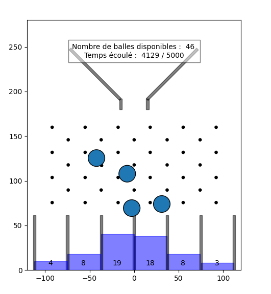
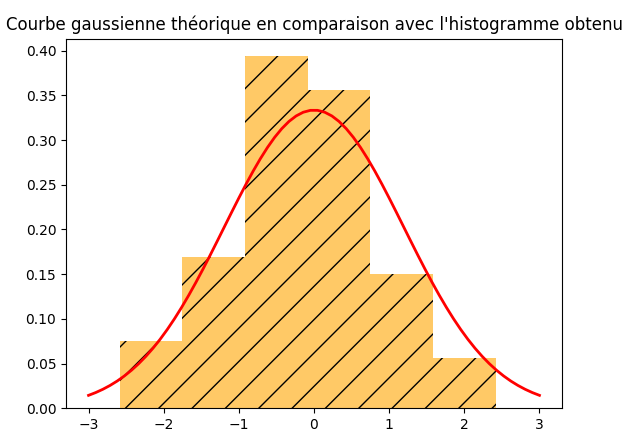

# 🕸️ Planche de Galton

Programme permettant de simuler une **planche de Galton** en Python en se basant sur la [bibliothèque minidem](https://gitlab.com/damien.andre/learning-python-for-science/-/tree/master/script/dem).

 ---

# 🎯Principe 
L'idée est de simuler la chute de balles sur des rangées de clous. Pour chacune des rangées, les balles passent soit à gauche soit à droite (expérience binomiale).

On compte finalement le nombre de balle arrivées dans chacune des colonnes en bas de la planche.

<p align="center">
   
</p>

La distribution des balles au sein de ces collones approche fortement la forme d'une Gaussienne, signe d'une distribution en loi normale.  

<p align="center">
   
</p>

---

# 📁 Structure du projet

```
planche-galton/
│
├── planche_galton.py        # Programme principal
├── minidem.py               # Bibliothèque éléments finis en Python
├── images/                  # Illustrations pour le readme
├── .gitignore
├── README.md
└── LICENSE.txt
```

---
# 👨‍🏭 Auteurs


**Elza Guérit**, **Pierre Bourrandy** - **ENSIL-ENSCI**

Ce projet a été réalisé dans le cadre du module d'informatique de 2ème année de Formation Initiale aux Métiers d'Ingénieurs. 

## Contact 
pierre.bourrandy@etu.unilim.fr *(ENSIL-ENSCI)*

https://github.com/Cnpruat/planche_galton *(GitHub)*

